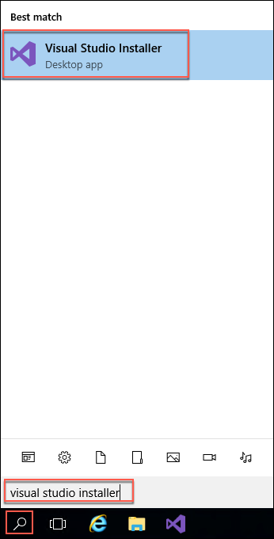
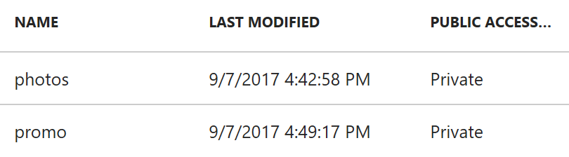
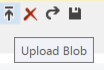
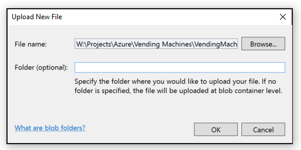

<div class="MCWHeader1">
Intelligent vending machines
</div>

<div class="MCWHeader2">
Hands-on lab setup guide
</div>

<div class="MCWHeader3">
May 2018
</div>

Information in this document, including URL and other Internet Web site references, is subject to change without notice. Unless otherwise noted, the example companies, organizations, products, domain names, e-mail addresses, logos, people, places, and events depicted herein are fictitious, and no association with any real company, organization, product, domain name, e-mail address, logo, person, place or event is intended or should be inferred. Complying with all applicable copyright laws is the responsibility of the user. Without limiting the rights under copyright, no part of this document may be reproduced, stored in or introduced into a retrieval system, or transmitted in any form or by any means (electronic, mechanical, photocopying, recording, or otherwise), or for any purpose, without the express written permission of Microsoft Corporation.

Microsoft may have patents, patent applications, trademarks, copyrights, or other intellectual property rights covering subject matter in this document. Except as expressly provided in any written license agreement from Microsoft, the furnishing of this document does not give you any license to these patents, trademarks, copyrights, or other intellectual property.

The names of manufacturers, products, or URLs are provided for informational purposes only and Microsoft makes no representations and warranties, either expressed, implied, or statutory, regarding these manufacturers or the use of the products with any Microsoft technologies. The inclusion of a manufacturer or product does not imply endorsement of Microsoft of the manufacturer or product. Links may be provided to third party sites. Such sites are not under the control of Microsoft and Microsoft is not responsible for the contents of any linked site or any link contained in a linked site, or any changes or updates to such sites. Microsoft is not responsible for webcasting or any other form of transmission received from any linked site. Microsoft is providing these links to you only as a convenience, and the inclusion of any link does not imply endorsement of Microsoft of the site or the products contained therein.
© 2018 Microsoft Corporation. All rights reserved.

Microsoft and the trademarks listed at <https://www.microsoft.com/en-us/legal/intellectualproperty/Trademarks/Usage/General.aspx> are trademarks of the Microsoft group of companies. All other trademarks are property of their respective owners.

## Contents

- [Intelligent vending machines hands-on lab setup guide](#intelligent-vending-machines-hands-on-lab-setup-guide)
  - [Task 1: Execute ARM template to provision Azure resources](#task-1-execute-arm-template-to-provision-azure-resources)
  - [Task 2: Connect to your Lab VM](#task-2-connect-to-your-lab-vm)
  - [Task 3: Confirm installation of R Tools for Visual Studio 2017](#task-3-confirm-installation-of-r-tools-for-visual-studio-2017)
  - [Task 4: Download the vending machines starter project](#task-4-download-the-vending-machines-starter-project)
  - [Task 5: Set up Photos Storage account containers](task-5-set-up-photos-storage-account-containers)
  - [Task 6: Configure Microsoft Machine Learning Server on Linux](task-6-configure-microsoft-machine-learning-server-on-linux)
- [Next steps](#next-steps)

# Intelligent vending machines hands-on lab setup guide

Duration: 45 minutes

In the Before the hands-on lab exercise, you will set up your environment for use in the rest of the hands-on lab. You should follow all the steps provided in the Before the hands-on lab section to prepare your environment **before attending** the hands-on lab. Failure to do so will significantly impact your ability to complete the lab within the time allowed.

> IMPORTANT: Most Azure resources require unique names. Throughout this lab you will see the word “SUFFIX” as part of resource names. You should replace this with your Microsoft alias, initials, or another value to ensure the resource is uniquely named.

## Task 1: Execute ARM template to provision Azure resources

In this task, you will run an Azure Resource Manager (ARM) template to provision many of the Azure resources you will be using throughout this lab. The ARM template provisions the following resources, and installs software on the Lab VM using a PowerShell script:

- Azure Resource group
- R Server on HDInsight cluster
- Windows Server 2016 (x64) virtual machine with the following software installed:
  - Visual Studio Community 2017
  - Power BI Desktop
  - Git Bash
  - R Tools for Visual Studio 2017 (RTVS)
  - Google Chrome web browser
- Microsoft Machine Learning Server on Linux
- Azure storage account for storing photos
- Azure SQL Database

> Note: If you want to review the steps for manually creating the resources provisioned by the ARM template, see [Appendix A](./appendix.md).

1. Select the **Deploy to Azure** button below to launch the script in a Custom deployment blade in the Azure portal

    <a href="https://portal.azure.com/#create/Microsoft.Template/uri/https%3A%2F%2Fraw.githubusercontent.com%2FMicrosoft%2FMCW-Intelligent-vending-machines%2Fmay-2018-update%2FHands-on%20lab%2Fdeployment-template%2Fazure-deploy.json" target="_blank">
    
    </a>

2. On the Custom deployment blade, enter the following:
    - **Subscription**: Select the subscription you are using for this hands on lab
    - **Resource group**: Choose Create new and enter hands-on-lab-SUFFIX as the resource group name
    - **Location**: Select the region you would like to use for resources in this hands-on lab. Remember this location so you can use it for the other resources you'll provision throughout this lab
    - **Resource Name Suffix**: Enter a unique suffix, such as your initials or Microsoft alias, to use for uniquely naming resources created by the ARM template
    - Leave the default values for the remaining resources, but note the values for later reference:
        - **Cluster Login Username**: admin
        - **SSH Username**: remoteuser
        - **Virtual Machine Username**: demouser
        - **ML Virtual Machine Username**: radmin
        - **Database Username**: demouser
        - **Database Name**: vending
        - **Database Server Name**: vendingmachines
        - All usernames use the password **Password.1!!**

        

3. Select **Purchase**

> It typically takes 15 - 20 minutes for the ARM template deployment to finish.

## Task 2: Connect to your Lab VM

In this task, you will create an RDP connection to your Lab virtual machine (VM), which is the Windows Server 2016 (x64) VM provisioned by the ARM template.

1. When the ARM template deployment has completed, navigate to the [Azure portal](https://portal.azure.com), select Resource groups in the Azure navigation pane, enter your resource group name (hands-on-lab-SUFFIX) into the filter box, and select it from the list

    

2. In the list of resources for your resource group, select the LabVM Virtual Machine

    

3. On your Lab VM blade, select Connect from the top menu

    

4. Select **Download RDP file**, then open the downloaded RDP file.

    

5. Select **Connect** on the Remote Desktop Connection dialog

    

6. Enter the following credentials when prompted:

    a. **User name**: demouser

    b. **Password**: Password.1!!

7. Select **Yes** to connect, if prompted that the identity of the remote computer cannot be verified

    

8. Once logged in, launch the **Server Manager**. This should start automatically, but you can access it via the Start menu if it does not start.

    

9. Select **Local Server**, then select **On** next to **IE Enhanced Security Configuration**

    

10. In the Internet Explorer Enhanced Security Configuration dialog, select **Off under Administrators**, then select **OK**

    

11. Close the Server Manager

## Task 3: Confirm installation of R Tools for Visual Studio 2017

In this task, you will confirm that R Tools for Visual Studio 2017 (RTVS) was successfully installed by the ARM template.

1. On your Lab VM, launch the Visual Studio Installer by select Search on the Windows task bar, entering "visual studio installer" into the search box, and selecting Visual Studio Installer for the results

    

2. Update the Visual Studio Installer, if prompted

3. Once the Installer starts, select **More**, then select **Modify**

    

    > Note: If the Visual Studio installation is up to date, Modify may appear where the Update button is in the above screenshot. If you wish to update Visual Studio first, select Update. This is not necessary for this hands-on lab, and the operation can take 30 minutes or more to complete.

4. Verify that the **Data science and analytical applications** workload is selected, indicated by a checked box in the upper right corner of the workload. If it is not, select the workload and select **Modify**

    

5. Close the Visual Studio Installer

## Task 4: Download the vending machines starter project

Trey Research has provided a starter solution for you. They have asked you to use this as the starting point for creating the Vending Machines solution in Azure.

1. From your LabVM, download the starter project by downloading a .zip copy of the Intelligent vending machines GitHub repo

2. In a web browser, navigate to the [Intelligent vending machines MCW repo](https://github.com/Microsoft/MCW-Intelligent-vending-machines)

3. On the repo page, select **Clone or download**, then select **Download ZIP**

    

4. Unzip the contents to the folder **C:\\VendingMachines\\**

## Task 5: Set up Photos Storage account containers

In these steps, you will add containers for photos and promos to the photostorageSUFFIX storage account in the Azure portal. This account will be used for storing photos sent from the vending machine simulator and for the storage of the promotional package resources.

1. In the [Azure portal](https://portal.azure.com), navigate to the photostorageSUFFIX storage account by selecting Resource groups from the Azure navigation pane, entering "hands-on-lab" in the filter box, selecting the hands-on-lab-SUFFIX resource group, and locating the photostorageSUFFIX storage account in the list of resources.

2. From the storage account Overview blade, select the Blobs tile under Services

    

3. In the Blob service blade, select **+Container** from the command bar

    

4. On the New container blade, set the name to "**photos**" and select **Private** as the Access type

    

5. Select **OK**

6. Repeat steps 6-8 to create another container named "**promo**"

7. You should now see both containers listed on the Blob service blade

    

8. Next, open Visual Studio and from the **View Menu** select **Cloud Explorer**

    

    > Note: You may need to select and enter the credentials for your Azure subscription, by clicking the person icon and expanding the subscriptions.

9. Expand **Storage accounts** and locate the photostorageSUFFIX account, and the **Blob Containers** you created underneath it

    

10. Right-click the promo container and select Open

11. Select the Upload blob button

    

12. Select **Browse**, and in the File dialog, select the three images `CoconutWater.png`, `Water.png`, and `Soda.png` from the starter solution's `Simulator\Images` folder, then select **Open**.

13. Select **OK** on the Upload New File Dialog to upload the images into the container

    

## Task 6: Configure Microsoft Machine Learning Server on Linux

In this task, you will perform some configuration on the Machine Learning Server that was provisioned by the ARM template.

1. In the [Azure portal](https://portal.azure.com), navigate to the Overview blade of the LabMLServer VM, select **Connect**, and copy the SSH command

    

2. On your Lab VM, open a new Git Bash window, and paste the SSH connection command you copied in the previous step. For example: `ssh radmin@40.70.129.190`

3. Execute the command to SSH into your Microsoft Machine Learning Server VM

4. When prompted if you want to continue connecting, enter **yes**

5. Enter your password, **Password.1!!**

6. At the prompt, after successfully logging in, enter the following command:

    ```bash
    sudo apt-get update -y
    ```

7. Type **exit** twice to disconnect from the SSH session

*These steps should be completed prior to starting the rest of the Lab.*

## Next steps

You are now ready to complete the hands-on lab. Select a guide below to get started, or you can return to the overview page for the lab.

- Complete Hands-on lab
  - [Step-by-step guide](./HOL-step-by-step-Intelligent-vending-machines.md)
  - [Unguided guide](./HOL-unguided-Intelligent-vending-machines.md)
- Return to [Hands-on lab readme](./readme.md)
