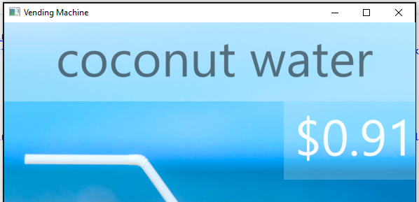

Intelligent vending machines

Hands-on lab unguided

May 2018

Information in this document, including URL and other Internet Web site references, is subject to change without notice. Unless otherwise noted, the example companies, organizations, products, domain names, e-mail addresses, logos, people, places, and events depicted herein are fictitious, and no association with any real company, organization, product, domain name, e-mail address, logo, person, place or event is intended or should be inferred. Complying with all applicable copyright laws is the responsibility of the user. Without limiting the rights under copyright, no part of this document may be reproduced, stored in or introduced into a retrieval system, or transmitted in any form or by any means (electronic, mechanical, photocopying, recording, or otherwise), or for any purpose, without the express written permission of Microsoft Corporation.

Microsoft may have patents, patent applications, trademarks, copyrights, or other intellectual property rights covering subject matter in this document. Except as expressly provided in any written license agreement from Microsoft, the furnishing of this document does not give you any license to these patents, trademarks, copyrights, or other intellectual property.

The names of manufacturers, products, or URLs are provided for informational purposes only and Microsoft makes no representations and warranties, either expressed, implied, or statutory, regarding these manufacturers or the use of the products with any Microsoft technologies. The inclusion of a manufacturer or product does not imply endorsement of Microsoft of the manufacturer or product. Links may be provided to third party sites. Such sites are not under the control of Microsoft and Microsoft is not responsible for the contents of any linked site or any link contained in a linked site, or any changes or updates to such sites. Microsoft is not responsible for webcasting or any other form of transmission received from any linked site. Microsoft is providing these links to you only as a convenience, and the inclusion of any link does not imply endorsement of Microsoft of the site or the products contained therein.
© 2018 Microsoft Corporation. All rights reserved.

Microsoft and the trademarks listed at <https://www.microsoft.com/en-us/legal/intellectualproperty/Trademarks/Usage/General.aspx> are trademarks of the Microsoft group of companies. All other trademarks are property of their respective owners.

## Contents

- [Intelligent vending machines hands-on lab unguided](#intelligent-vending-machines-hands-on-lab-unguided)
  [Abstract and learning objectives](#abstract-and-learning-objectives)
  - [Overview](#overview)
  - [Solution architecture](#solution-architecture)
  - [Requirements](#requirements)
  - [Exercise 1: Create Dynamic Pricing Model](#exercise-1-create-dynamic-pricing-model)
    - [Task 1: Create a model locally](#task-1-create-a-model-locally)
    - [Task 2: Try a prediction locally](#task-2-try-a-prediction-locally)
    - [Task 3: Create the model in R Server on HDInsight](#task-3-create-the-model-in-r-server-on-hdinsight)
    - [Task 4: Create predictive service in R Server Operationalization](#task-4-create-predictive-service-in-r-server-operationalization)
  - [Exercise 2: Implement dynamic pricing](#exercise-2-implement-dynamic-pricing)
    - [Task 1: Implement photo uploads to Azure Storage](#task-1-implement-photo-uploads-to-azure-storage)
    - [Task 2: Provision Cognitive Services Face API](#task-2-provision-cognitive-services-face-api)
    - [Task 3: Invoke Face API](#task-3-invoke-face-api)
    - [Task 4: Invoke pricing model](#task-4-invoke-pricing-model)
    - [Task 5: Configure the Simulator](#task-5-configure-the-simulator)
    - [Task 6: Test dynamic pricing in Simulator](#task-6-test-dynamic-pricing-in-simulator)
  - [Exercise 3: Implement purchasing](#exercise-3-implement-purchasing)
    - [Task 1: Create the transactions table](#task-1-create-the-transactions-table)
    - [Task 2: Configure the Simulator](#task-2-configure-the-simulator)
    - [Task 3: Test purchasing](#task-3-test-purchasing)
  - [Exercise 4: Implement device command and control](#exercise-4-implement-device-command-and-control)
    - [Task 1: Provision IoT Hub](#task-1-provision-iot-hub)
    - [Task 2: Listen for control messages](#task-2-listen-for-control-messages)
    - [Task 3: Send control messages](#task-3-send-control-messages)
    - [Task 4: Configure the DeviceControlConsole and Simulator](#task-4-configure-the-devicecontrolconsole-and-simulator)
  - [Exercise 5: Analytics with Power BI Desktop](#exercise-5-analytics-with-power-bi-desktop)
    - [Task 1: Build the query and create the visualization](#task-1-build-the-query-and-create-the-visualization)
  - [After the hands-on lab](#after-the-hands-on-lab)

# Intelligent vending machines hands-on lab unguided

If you have not yet completed the steps to set up your environment in [Before the hands-on lab](./Before%20the%20HOL%20-%20Intelligent%20vending%20machines.md), you will need to do that before proceeding.

## Abstract and learning objectives

In this hands-on lab, you will implement an IoT solution for intelligent vending machines, leveraging facial feature recognition and Azure machine learning, to gain a better understanding of building cloud-based machine learning apps and real-time analytics with SQL Database in-memory and columnar indexing.

At the end of this hands-on lab, you will be better able to build IoT solutions leveraging cloud-based machine learning services and real-time analytics.

## Overview

Trey Research Inc. looks at the old way of doing things in retail and introduces innovative experiences that delight customers and drive sales. Their latest initiative focuses on intelligent vending machines that support commerce, engagement analytics, and intelligent promotions.

## Solution architecture

Below is a diagram of the solution architecture you will build in this lab. Please study this carefully, so you can understand the whole of the solution as you are working on the various components.

![Diagram of the preferred solution. From a high-level, the commerce solution uses an API App to host the Payments web service with which the Vending Machine interacts to conduct purchase transactions. The Payment Web API invokes a 3rd party payment gateway as needed for authorizing and capturing credit card payments, and logs the purchase transaction to SQL DB. The data for these purchase transactions is stored using an In-Memory table with a Columnar Index, which will support the write-heavy workload while still allowing analytics to operate, such as queries coming from Power BI Desktop.](./media/preferred-solution-architecture.png "Preferred high-level architecture")

## Requirements

- Microsoft Azure subscription must be pay-as-you-go or MSDN
  - Trial subscriptions will not work
- A virtual machine configured with:
  - Visual Studio Community 2017 15.6 or later
  - Azure SDK 2.9 or later (Included with Visual Studio 2017)
  - [R Tools for Visual Studio](https://aka.ms/rtvs-current) 0.3.2 or later
  - [Power BI Desktop](https://powerbi.microsoft.com/desktop) (June 2016 build or later)
  - A running R Server on HD Insight Spark cluster (see [Before the hands-on lab](#before-the-hands-on-lab))

## Exercise 1: Create Dynamic Pricing Model

Duration: 45 minutes

In this exercise, you will create a machine learning model that predicts the purchase price for an item sold by the vending machine, provided the demographics of the customer and the item. You will then operationalize this model by exposing it as a web service hosted in Azure Machine Learning, and test it out.

### Task 1: Create a model locally

#### Tasks to complete

- On your Lab VM, locate the starter project solution file, VendingMachines.sln, in the C:\VendingMachines\Hands-on-lab\starter-project folder and double-click it to open it with Visual Studio 2017
- In Visual Studio, open `TrainModel.r` located within the PricingModel project
- Run the text between the "Create Sample Data" and "END Create Sample Data" comments, and view the sampleData created in the Variable Explorer window
- Complete TODOs 1 through 4

#### Exit criteria

- In the same folder as your script, you should have the files `sampleData.RData`, `pricingModel.RData`, and `inputExample.RData`

### Task 2: Try a prediction locally

#### Tasks to complete

- In Visual Studio, open `PredictUsingModel.r` located within the PricingModel project
- Complete TODO 1 through 2
- Run the script

#### Exit criteria

- Using Variable Explorer, expand the prediction variable and observe the price model suggested to use for purchasing the coconut water for the input of a 30-year-old female

    

### Task 3: Create the model in R Server on HDInsight

#### Tasks to complete

- SSH into your R Server on HDInsight Cluster
- Run the R shell
- Copy the script text from `TrainModel.r` and paste it into the shell to train the model using R running across your HDInsight cluster
- Copy the generated files `sampleData.RData`, `pricingModel.RData`, and `inputExample.RData` to the /models folder in HDFS
- Use Visual Studio to download the `sampleData.RData`, `pricingModel.RData`, and `inputExample.RData` from Blob storage to the PricingModel project directory, overwriting existing files as necessary

#### Exit criteria

- You should have the files `sampleData.RData`, `pricingModel.RData`, and `inputExample.RData` copied down to the PricingModel project directory on your local machine

### Task 4: Create predictive service in R Server Operationalization

After training a model, you want to operationalize the model so that it becomes available for integration by developers. One way to operationalize a trained model is to take the model you trained in HDInsight, and then to expose that as a predictive web service. In this task, you take a version of the scripts you have been running locally and in HDInsight and migrate them to run in the VM that is running R.

#### Tasks to complete

- SSH into your Microsoft Machine Learning Server VM
- Use the Azure CLI commands to configure Microsoft R Server operationalization with a One-box configuration
  - `sudo -i`
  - `az ml admin node setup --onebox --admin-password Password.1!! --confirm-password Password.1!!`
- Update the `App.config` for the Simulator project with these settings:
  - **rServiceBaseAddress**: Your server IP and web node port (example: http://<your-server-ip>:12800)
  - **rServicePassword**: as set when you configured R Server operationalization
- Update the `TODO 1` section of the `PredictPricingService.r` file within the PricingModelProject to reference the following packages:
  - curl
  - ggplot2
  - mrsdeploy
  - RevoScaleR
- Update `TODO 2` to remoteLogin to the R Server operationalization web node with the admin user and configured password
- Execute all the code interactively to publish the service
- Update `TODO 3` to consume the API as a test, printing the result\$output("answer") value
- Update `TODO 4` to generate the Swagger JSON file for the API, and save it as `swagger.json` to the project directory
- Execute the code for TODOs 3 and 4

#### Exit criteria

- You successfully configured Microsoft Machine Learning Server operationalization
- Your apiPredictPurchasePrice service was successfully published
- You are able retrieve a prediction result from the service
- You have generated the Swagger JSON file for the service

## Exercise 2: Implement dynamic pricing

Duration: 45 minutes

In this exercise, you will implement the code that performs dynamic pricing, capitalizing on the Face API to acquire demographics, and your deployed pricing model to suggest the price based on those demographics. You will then run the vending machine simulator and see the dynamic pricing in action.

### Task 1: Implement photo uploads to Azure Storage

#### Tasks to complete

- In Visual Studio Solution Explorer, expand the Simulator project, open `MainWindow.xaml.cs` and scroll to the `UpdateDynamicPricing` method
- Complete TODOs 1 through 3
- Save the file

#### Exit criteria

- You have removed any errors around TODO items 1 through 3

### Task 2: Provision Cognitive Services Face API

To provision access to the Face API (which provides demographic information about photos of human subjects), you will need to provision a Cognitive Services account.

#### Tasks to complete

- In the [Azure portal](https://portal.azure.com), provision a new Cognitive Services Face API
- Copy the Face API's endpoint and Key 1 values

#### Exit criteria

- Your Face API has been provisioned
- You have copied the endpoint value
- You have copied the Key 1 value

### Task 3: Invoke Face API

#### Tasks to complete

- Within `MainWindow.xaml.cs`, locate the `GetBlobSasUri` method
- Complete TODOs 4 through 9
- Save the file

#### Exit criteria

- You have removed any errors around TODO items 4 through 9

### Task 4: Invoke pricing model

#### Tasks to complete

- Within `MainWindow.xaml.cs`, locate the `UpdateDynamicPrice` method
- Complete TODO 10
- Save the file

#### Exit criteria

- You have removed any errors around TODO item 10

### Task 5: Configure the Simulator

#### Tasks to complete

- In Visual Studio, open `App.config` within the Simulator project
- Within the appSettings section, set the following settings:
  - **faceAPIKey**: set this to the KEY 1 value for your Face API as acquired from the Azure Portal
  - **faceEndpoint**: set this to the ENDPOINT value for your Face API as acquired from the Azure Portal (for example: <https://eastus2.api.cognitive.microsoft.com/face/v1.0>)
  - **storageConnectionString**: set this to the connection string for the Storage Account you created with the photos container
- Save `App.config`

#### Exit criteria

- You have values for the settings in the config file

### Task 6: Test dynamic pricing in Simulator

#### Tasks to complete

- Set the Simulator project as the startup project
- Run the Simulator without debugging
- Take a picture using the simulator

#### Exit criteria

- In a few moments, you should see the price change from $1.25 to whatever value the predictive model suggested

    

## Exercise 3: Implement purchasing

Duration: 15 minutes

In this exercise, you will create an in-memory, columnar index table in SQL DB that will be used to support purchase transactions in a real-time analytics fashion, and then implement the purchasing process in the vending machine simulator. Finally, you will run the simulator and purchase items.

### Task 1: Create the transactions table

#### Tasks to complete

- Within Visual Studio Solution Explorer, expand the SQL Scripts folder and open the file `Create Table.sql`
- Complete TODOs 1 through 4
- Save the script
- Execute the script against your SQL database

#### Exit criteria

- You have successfully executed the SQL script against the vending database

### Task 2: Configure the Simulator

#### Tasks to complete

- In the Simulator project, open `App.config`
- Within the connectionString section, set the following:
  - **TransactionsModel**: set the value of the connectionString attribute to the ADO.NET connection string to your SQL DB instance
- Save `App.config`

#### Exit criteria

- The value for the connectionString has been updated

### Task 3: Test purchasing

#### Tasks to complete

- Build the Simulator
- Start the Simulator without debugging
- In the Simulator, select Buy

#### Exit criteria

- You should see a confirmation dialog similar to the following:

    

## Exercise 4: Implement device command and control

Duration: 45 minutes

In this exercise, you will implement the ability to push new promotions to the vending machine simulator using the command and control features of IoT Hub. You will update the simulator to listen for these messages. You will also update the console application DeviceControlConsole to send selected promotions.

### Task 1: Provision IoT Hub

In these steps, you will provision an instance of IoT Hub

#### Tasks to complete

- In the [Azure portal](https://portal.azure.com), provision a new **IoT Hub**
- Copy the **iothubowner**'s Shared access policy **Connection string - primary key**

#### Exit criteria

- You have provisioned a new IoT Hub in Azure
- You have copied the connection string for the IoT Hub Owners shared access policy

### Task 2: Listen for control messages

#### Tasks to complete

- Within Visual Studio Solution Explorer, expand the Simulator project, and open the file `MainWindow.xaml.cs`
- Complete TODOs 1 through 4
- Save the file

#### Exit criteria

- You have no errors around TODO items 1 through 4 in `MainWindow.xaml.cs`

### Task 3: Send control messages

#### Tasks to complete

- Within Visual Studio Solution Explorer, expand the **DeviceControlConsole** project, and open the file `Program.cs`
- Complete TODOs 1 and 2
- Save the file

#### Exit criteria

- You have no errors around TODO items 1 and 4 in `Program.cs`

### Task 4: Configure the DeviceControlConsole and Simulator

#### Tasks to complete

- In **DeviceControlConsole**, open `App.config`
- Set the `IoTHubConnectionString` appSetting to have a value of the connection string for the service policy to your IoT Hub (recall you can get this from the Azure Portal IoT Hub blade, Shared access policies, and then select the policy)
- Set the `storageConnectionString` appSetting to have the same connection string for your storage account that the `App.config` file in the Simulator project has
- Save the file
- In the Simulator project, open `App.config`
- Set the `IoTHubSenderConnectionString` appSetting to have a value of the connection string for the device policy to your IoT Hub
- Set the `IoTHubManagerConnectionString` appSetting to have a value of the connection string for the **iothubowner** policy to your IoT Hub
- Save the file
- Set both DeviceControlConsole and Simulator to startup projects for the solution

#### Exit criteria

- Both the Vending Machine Simulator and the DeviceControlConsole to appear

    

- In the DeviceControlConsole, press 1 to push the promotion for Soda

    

- The entire promotion surface of the vending machine changes (product name, price, and image)

## Exercise 5: Analytics with Power BI Desktop

Duration: 15 minutes

In this exercise, you will use Power BI Desktop to query purchase data from the in-memory table of SQL DB and visualize the result.

### Task 1: Build the query and create the visualization

#### Tasks to complete

- Open Power BI Desktop and connect to your SQL Database
- Query the transactions table
- Create a Stacked column chart visualization that displays the sum of the purchase price by minute across all the data in the table

#### Exit criteria

- Your completed visualization summarizing the most profitable minutes in each hour should appear as follows:

    

## After the hands-on lab

Duration: 10 mins

In this exercise, you will delete any Azure resources that were created in support of the lab. You should follow all steps provided after attending the Hands-on lab to ensure your account does not continue to be charged for lab resources.

### Task 1: Delete the resource group

1. Using the [Azure portal](https://portal.azure.com), navigate to the Resource group you used throughout this hands-on lab by selecting Resource groups in the left menu
2. Search for the name of your research group, and select it from the list
3. Select Delete in the command bar. Confirm the deletion by re-typing the Resource group name and selecting Delete.

You should follow all steps provided *after* attending the Hands-on lab.
