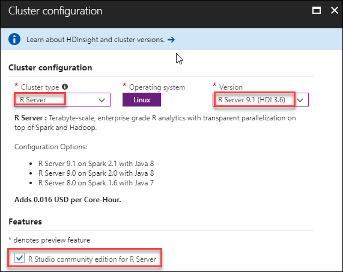
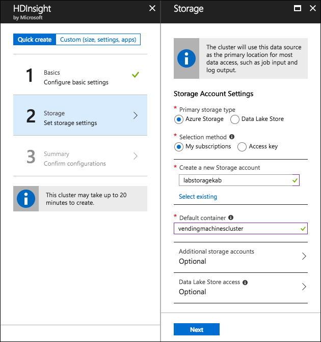
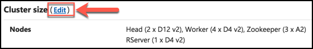
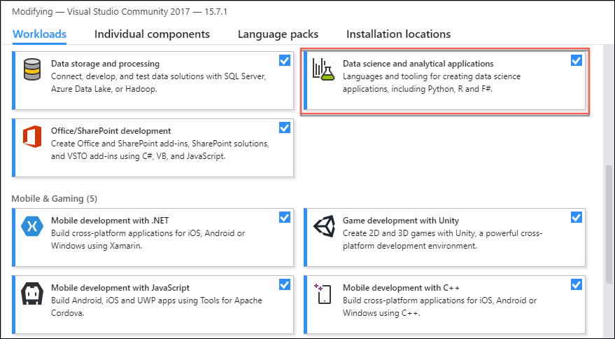
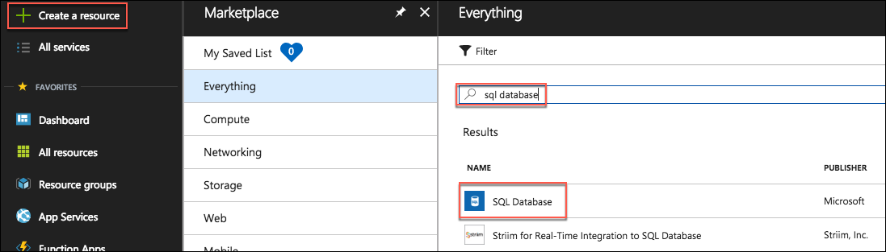
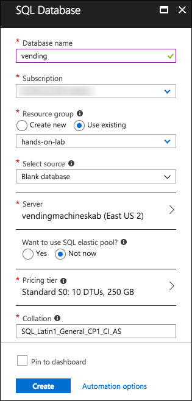

# Appendix A: Create lab resources manually

This appendix provides step-by-step instructions for manually creating the lab resources that are provisioned by the ARM template used in the [Before the hands-on lab](./Setup.md) section. If you follow these steps, you will still need to complete the steps in Before the Hands-on Lab after creating and configuring the resources below.

## Contents

* [Task 1: Provision a resource group](#task-1-provision-a-resource-group)
* [Task 2: Provision an R Server on HDInsight with Spark cluster](#task-2-provision-an-r-server-on-hdinsight-with-spark-cluster)
* [Task 3: Setup a lab virtual machine (VM)](#task-3-setup-a-lab-virtual-machine)
* [Task 4 Install Power BI Desktop on the Lab VM](#task-4-install-power-bi-desktop-on-the-lab-vm)
* [Task 5: Install an SSH client](#task-5-install-an-ssh-client)
* [Task 6: Install R Tools for Visual Studio 2017](#task-6-install-r-tools-for-visual-studio-2017)
* [Task 7: Create Storage Account](#task-7-create-storage-account)
* [Task 8: Create Microsoft Machine Learning Server on Linux](#task-8-create-microsoft-machine-learning-server-on-linux)
* [Task 9: Provision SQL Database](#task-9-provision-sql-database)

## Task 1: Provision a resource group

In this task, you will create an Azure resource group for the resources used throughout this lab.

1. In the [Azure portal](https://portal.azure.com), select **Resource groups**, select **+Add**, then enter the following in the Create an empty resource group blade:

    * **Name**: Enter hands-on-lab-SUFFIX

    * **Subscription**: Select the subscription you are using for this hands-on lab

    * **Resource group location**: Select the region you would like to use for resources in this hands-on lab. Remember this location so you can use it for the other resources you'll provision throughout this lab.

        

    * Select **Create**.

## Task 2: Provision an R Server on HDInsight with Spark cluster

In this task, you will use the Azure Portal to provision an R Server on HDInsight with Spark cluster.

1. In the [Azure portal](https://portal.azure.com), select **+Create a resource**, enter "hdinsight" into the Search the Marketplace box,select **HDInsight** in the results, and select **Create**.

    

2. On the Basics blade, enter the following settings:

    * **Cluster name**: Enter a unique name (verified by the green checkmark)

    * **Subscription**: Select the Azure subscription into which you want to deploy the cluster

    * **Custer type**: Select Configure required settings

        

        * On the Cluster configuration blade, set the Cluster type to **R Server** and the Version to R Server **9.1 (HDI 3.6)**

        * Check the box next to **R Studio community edition for R Server**. Note that the Operating System option for the Spark cluster is fixed to Linux

            

        * Select **Select** to close the Cluster configuration blade

    * **Cluster login username**: Leave as admin

    * **Cluster login password**: Enter Password.1!!

    * **Secure Shell (SSH) username**: Set to remoteuser (**this is required**)

    * **Use same password as cluster login**: Ensure the checkbox is checked

    * **Resource group**: Choose Use existing, and select the hands-on-lab-SUFFIX resource group

    * **Location**: Select the location you are using for resources in this hands-on lab

        

    * Select **Next** to move on to the storage settings

3. On the Storage blade:

    * **Primary storage type**: Leave set to Azure Storage

    * **Selection Method**: Leave set to My subscriptions

    * **Select a Storage account**: Select Create new, and enter a unique name for the storage account, such as labstorageSUFFIX

    * **Default container**: Set to the *name of your cluster*

    * **Additional storage accounts**: Leave un-configured.

    * **Data Lake Store access**: Leave un-configured.

    * **Metastore Settings**: Leave blank.

        

    * Select **Next** to move on to the Cluster summary.

4. On the Cluster Summary blade, select Edit next to Cluster Size.

    

5. On the Cluster size blade, enter the following:

    * **Number of worker nodes**: Enter 2

    * **Worker node size**: Select D12 v2, then select Select

    * **Head node size**: Select D12 v2, then select Select

    * **Zookeeper node sizes**: Leave set to A2

    * **R-Server edge node size**: Select D12 v2, then select Select

        

    * Select **Next**.

6. Select **Next** on the Advanced settings blade to move to the Cluster summary blade.

7. Select **Create** on the Cluster summary blade to create the cluster.

8. It will take approximately 20 minutes to create you cluster. You can move on to the steps below while the cluster is provisioning.

## Task 3: Setup a lab virtual machine

1. In the [Azure portal](https://portal.azure.com/), select **+Create a resource**, enter "visual studio community" into the Search the Marketplace box, select **Visual Studio Community 2017 (latest release) on Windows Server 2016 (x64)** from the results, and select **Create**.

    

2. Set the following configuration on the Basics tab.

    * **Name**: Enter LabVM

    * **VM disk type**: Select SSD

    * **User name**: Enter demouser

    * **Password**: Enter Password.1!!

    * **Subscription**: Select the same subscription you are using for this hands-on lab

    * **Resource Group**: Select Use existing, and select the hands-on-lab-SUFFIX resource group

    * **Location**: Select the location you are using for resources in this hands-on lab

        

    * Select **OK** to move to the next step.

3. On the Choose a size blade, select DS2_V3 Standard.

    

4. Select **Select** to move on to the Settings blade.

5. On the Settings blade, select **RDP (3389)** from the Select public inbound ports drop down, then select **OK**.

    

6. Select **Create** on the Create blade to provision the virtual machine.

7. It may take 10+ minutes for the virtual machine to complete provisioning.

## Task 4: Install Power BI Desktop on the Lab VM

1. Connect to the **LabVM**, following the steps provided in [Before the Hands-on Lab, Task 2](./Setup.md).

2. In a web browser on the Lab VM navigate to the [Power BI Desktop download page](https://www.microsoft.com/en-us/download/details.aspx?id=45331)

3. Select the **Download Free** link in the middle of the page.

    

4. Select the **x64 bit version** of the download, then select **Next**.

    

5. Run the installer once it downloads.

6. Select Next on the welcome screen.

    

7. Accept the license agreement, and select Next.

    

8. Leave the default destination folder, and select Next.

    

9. Make sure the Create a desktop shortcut box is checked, and select Install.

    

10. Uncheck Launch Microsoft Power BI Desktop, and select Finish.

    

## Task 5: Install an SSH client

In this task, you will download and install the Git Bash SSH client. You will use this to access your HDInsight cluster from your Lab VM.

1. On your Lab VM, open a web browser and navigate to the [Git Bash download page](https://git-scm.com/downloads) to download the latest version of Git Bash.

    

2. Select the **Download for 2.17.x for Windows** button.

3. Run the downloaded installer, selecting **Next** on each screen to accept the defaults.

4. On the last screen, select **Install** to complete the installation.

    

5. When the install is complete, uncheck **View Release Notes**, and select **Finish**.

    

## Task 6: Install R Tools for Visual Studio 2017

In this task, you will install R Tools for Visual Studio 2017 (RTVS).

1. Launch the Visual Studio Installer by select Search on the Windows task bar, entering "visual studio installer" into the search box, and selecting Visual Studio Installer for the results.

    

2. Update the Visual Studio Installer, if prompted.

3. Once the Installer starts, select **More**, then select **Modify**.

    

    > Note: If the Visual Studio installation is up to date, Modify may appear where the Update button is in the following screenshot. If you wish to update Visual Studio first, select Update. This is not necessary for this hands-on lab, and the operation can take 30 minutes or more to complete.

4. Select the **Data science and analytical applications** workload by checking the box in the upper right corner of the workload, then select **Modify**.

    

## Task 7: Create Storage Account

In these steps, you will provision a storage account that will be used for storing photos sent from the vending machine simulator and for the storage of the promotional package resources.

1. Using the Azure Portal, select **Create a resource**, **Storage**, select **Storage account** from the results, and select **Create**.

    

2. On the Create storage account blade, enter the following values:

    * **Name**: Enter a unique name, such as labstorageSUFFIX

    * **Deployment model**: Leave Resource Manager selected

    * **Account kind**: Select Storage (General purpose v1)

    * **Location**: Select the location you are using for this hands-on lab

    * **Replication**: Select to Locally-redundant storage (LRS)

    * **Performance**: Leave set to Standard

    * **Secure transfer required**: Leave set to Disabled

    * **Subscription**: Select the subscription you are using for this hands-on lab

    * **Resource group**: Choose Use existing, and select the hands-on-lab-SUFFIX resource group

    * **Virtual networks**: Leave set to Disabled

        

    * Select **Create**

## Task 8: Create Microsoft Machine Learning Server on Linux

In these steps, you will provision and configure a Virtual Machine running Microsoft Machine Learning Server on Ubuntu. You will use this machine to host the R Server Operationalization service.

1. In the [Azure Portal](https://portal.azure.com), select **+Create a resource**, enter **Machine Learning Server** into the Search the Marketplace box, select **Microsoft Machine Learning Server 9.3.0 on Ubuntu 16.04** from the results, and select **Create**.

    

2. In the Create virtual machine Basics blade, enter the following:

    * **Name**: Enter LabMLServer

    * **Vm disk type**: Select SSD

    * **User name**: Enter radmin

    * **Authentication type**: Select Password

    * **Password**: Enter and confirm the password, Password.1!!

    * **Subscription**: Select the subscription you are using for this hands-on lab

    * **Resource group**: Choose Use existing, and select the hands-on-lab-SUFFIX resource group

    * **Location**: Select the location you are using for this hands-on lab

        

    * Select **OK** to move on to choosing a VM size.

3. On the Choose a size blade, select **E2S_V3 Standard**, and select **Select**.

    

4. On the Settings blade, select **Network security group** (firewall).

    * Click **Create new** under Choose network security group.

    * Enter a name, such as **my-r-nsg**.

    * Select **Add an inbound rule**.

        

    * On the Add inbound security rule dialog, enter the following (you may need to select Basic at the top of the Add inbound security rule dialog to switch from the Advanced view to the one displayed below):

        * **Service**: Select Custom

        * **Port range**: 12800

        * **Priority**: 100

        * **Name**: **Port_12800** (should be auto-generated)

            

        * Select **OK**

5. Select **OK** on the Create network security group blade.

6. Select **OK** on the Settings blade.

7. Select Create on the Summary blade.

    

## Task 9: Provision SQL Database

In these steps, you will provision a SQL database to support the transactions and real-time analytics.

1. In the [Azure portal](https://portal.azure.com), select **Create a resource**, enter "sql database" into the Search the Marketplace box, select **SQL Database** from the results, and select **Create**.

    

2. In the SQL Database blade, enter the following:

    * **Database name**: Enter vending

    * **Subscription**: Select the subscription you are using for this hands-on lab

    * **Resource Group**: Choose Use existing and select the hands-on-lab-SUFFIX resource group

    * **Select source**: Leave set to **Blank database**

    * **Server**: Select configure required settings, then select Create a new server

        * **Server name**: Enter a unique server name, such as vendingmachinesSUFFIX

        * **Server admin login**: Enter demouser

        * **Password**: Enter Password.1!!

        * **Location**: Select the location you are using for this hands-on lab

            

        * Select **Select**

    * **Want to use SQL elastic pool**: Choose Not now

    * **Pricing tier**: Change to **Premium P1**, and select **Apply**.

        

    * **Collation**: Leave set to the default value (SQL_Latin1_General_CP1_CI_AS)

        

    * Select **Create**.