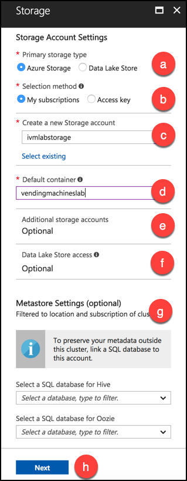
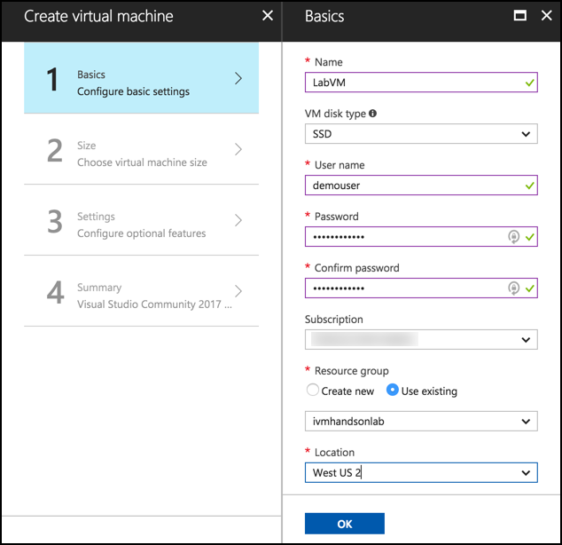
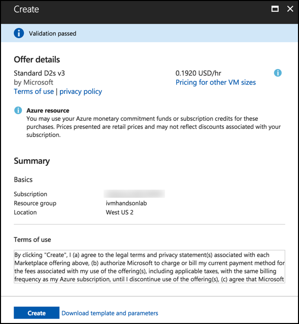
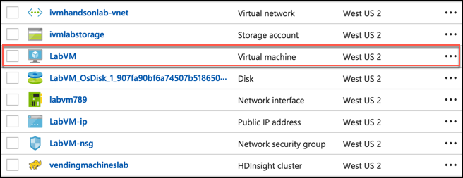
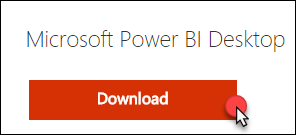
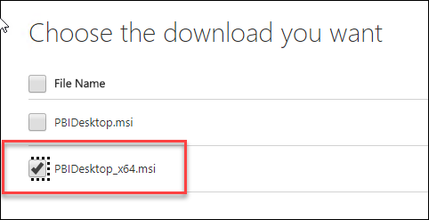
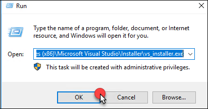
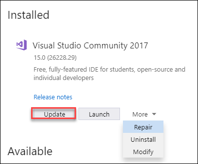
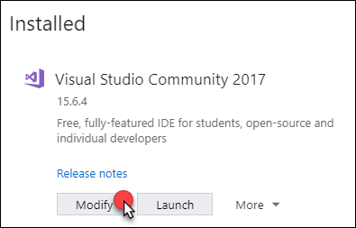

# Intelligent Vending Machines setup

## Requirements

-   Microsoft Azure subscription must be pay-as-you-go or MSDN.

    -   Trial subscriptions will not work.

-   A virtual machine configured with:

    -   Visual Studio Community 2017 15.6 or later

    -   Azure SDK 2.9 or later (Included with Visual Studio 2017)

    -   [R Tools for Visual Studio](https://aka.ms/rtvs-current) 0.3.2 or later

    -   [Power BI Desktop](https://powerbi.microsoft.com/desktop) (June 2016 build or later)

-   A running R Server on HD Insight Spark cluster 

## Before the hands-on lab

Duration: 75 minutes

Synopsis: In this exercise, you will set up your environment for use in the rest of the hands-on lab. You should follow all the steps provided in the Before the Hands-on Lab section to prepare your environment before attending the hackathon.

### Task 1: Provision an R Server on HDInsight with Spark cluster

Using the Azure Portal, provision a new HDInsight cluster.

1.  Open a browser and go to <https://portal.azure.com>.

2.  Select **+Create a resource,** select **Data + Analytics**, **HDInsight**.

    

3.  On the Basics blade, enter the following settings:

    -   Cluster name: Enter a **unique name** (verified by the green checkmark).

    -   Subscription: Select the Azure subscription into which you want to deploy the cluster.

    -   Custer type: Select Configure required settings.

        

        i.  On the Cluster configuration blade, set the Cluster type to **R Server** and the Version to R Server **9.1 (HDI 3.6).**

        ii. Check the box next to **R Studio community edition for R Server**. Note that the Operating System option for the Spark cluster is fixed to Linux.

        

        iii. Click **Select** to close the Cluster configuration blade.

    -   Cluster login username: Leave as **admin**.

    -   Cluster login password: Enter **Password.1!!** for the admin password.

    -   Secure Shell (SSH) username: Set to **remoteuser** (this is required).

    -   Use same password as cluster login: Ensure the checkbox is checked.

    -   Resource group: Select the **Create new** radio button, and enter **ivmhandsonlab** for the resource group name.

    -   Select the desired location from the dropdown list.

    -   Select **Next** to move on to the storage settings.

        

4.  On the Storage blade:

    -   Primary storage type: Leave set to **Azure Storage**.

    -   Selection Method: Leave set to **My subscriptions**.

    -   Select a Storage account: Select **Create new**, and enter a name for the storage account, such as ivmlabstorage.

    -   Default container: Set to the **name of your cluster**.

    -   Additional storage accounts: Leave unconfigured.

    -   Data Lake Store access: Leave unconfigured.

    -   Metastore Settings: Leave blank.

    -   Select **Next** to move on to the Cluster summary.

        

5.  On the Cluster Summary blade, select Edit next to Cluster Size. 

    

6.  On the Cluster size blade, enter the following:

    -   Number of worker nodes: Enter **2**.

    -   Select **Worker node size**, and select **D12 v2**, then click **Select**.

    -   Select **Head node size**, and select **D12 v2**, then click **Select**.

    -   Leave the Zookeeper node sizes set to A2.

    -   Select **R-Server edge node size**, and select **D12 v2**, then click **Select**.

    -   Select **Next**.

        

7.  Select **Next** on the Advanced settings blade to move to the Cluster summary blade.

8.  Select **Create** on the Cluster summary blade to create the cluster.

9.  It will take approximately 20 minutes to create you cluster. You can move on to the steps below while the cluster is provisioning.

### Task 2: Setup a lab virtual machine (VM)

1.  In the [Azure Portal](https://portal.azure.com/), select **+Create a resource**, then type "Visual Studio" into the search bar. Select Visual Studio Community 2017 on Windows Server 2016 (x64) from the results. 

    

2.  On the blade that comes up, at the bottom, ensure the deployment model is set to Resource Manager and select Create.

    

3.  Set the following configuration on the Basics tab.

    -   Name: Enter **LabVM**.

    -   VM disk type: Select **SSD**.

    -   User name: Enter **demouser**

    -   Password: Enter **Password.1!!**

    -   Subscription: Select the same subscription you used to create your cluster in [Task 1](#task-1-provision-an-r-server-on-hdinsight-with-spark-cluster).

    -   Resource Group: Select Use existing, and select the resource group you provisioned while creating your cluster in Task 1.

    -   Location: Select the same region you used in Task 1 while creating your cluster. 

        

4.  Select **OK** to move to the next step.

5.  On the Choose a size blade, ensure the Supported disk type is set to SSD, and select View all. This machine won't be doing much heavy lifting, so selecting DS2\_V3 Standard is a good baseline option. 

    

6.  Click **Select** to move on to the Settings blade.

7.  Accept all the default values on the Settings blade, and Select **OK**.

8.  Select Create on the Create blade to provision the virtual machine. 

    

9.  It may take 10+ minutes for the virtual machine to complete provisioning.

### Task 3: Install Power BI Desktop on the lab VM

1.  Connect to the **LabVM**. (If you are already connected to your Lab VM, skip to Step 7.)

2.  From the left side menu in the Azure portal, click on Resource groups, then enter your resource group name into the filter box, and select it from the list. 

    

3.  Next, select your lab virtual machine, LabVM, from the list. 

    

4.  On your Lab VM blade, select Connect from the top menu. 

    

5.  Download and open the RDP file.

6.  Select **Connect**, and enter the following credentials (or the non-default credentials if you changed them):

    a.  User name: **demouser**

    b.  Password: **Password.1!!**

7.  Once logged in, launch the **Server Manager**. This should start automatically, but you can access it via the Start menu if it does not start.

8.  Select **Local Server**, then select **On** next to **IE Enhanced Security Configuration**. 

    

9.  In the Internet Explorer Enhanced Security Configuration dialog, select **Off under Administrators**, then select **OK**. 

    

10. Close the Server Manager.

11. In a web browser on the Lab VM navigate to the Power BI Desktop download page <https://www.microsoft.com/en-us/download/details.aspx?id=45331>

12. Select the **Download Free** link in the middle of the page.

    

13. Select the **x64 bit version** of the download, then click **Next**.

    

14. Run the installer once it downloads.

15. Select Next on the welcome screen. 

    

16. Accept the license agreement, and select Next. 

    

17. Leave the default destination folder, and select Next. 

    

18. Make sure the Create a desktop shortcut box is checked, and select Install. 

    

19. Uncheck Launch Microsoft Power BI Desktop, and select Finish. 

    

### Task 4: Prepare an SSH client

In this task, you will download, install, and prepare the Git Bash SSH client that you will use to access your HDInsight cluster from your Lab VM.

1.  On your Lab VM, open a browser, and navigate to <https://git-scm.com/downloads> to download Git Bash. 

    

2.  Select the download for your OS, and then select the Download button.

3.  Run the downloaded installer, select Next on each screen to accept the defaults.

4.  When the install is complete, you will be presented with the following screen: 

    

5.  Check the Launch Git Bash checkbox, and uncheck View Release Notes. Select **Finish.**

6.  The Git Bash client should open in a new window.

7.  At the command prompt, enter **ssh remoteuser@\<clustername\>-ssh.azurehdinsight.net**, replacing \<clustername\> with the name of the HDInsight cluster created in [Task 1](#task-1-provision-an-r-server-on-hdinsight-with-spark-cluster) above.

**Note:** You will need to wait for the cluster deployment to complete in Azure before you can complete this step. 

8.  Respond to any prompts in the SSH window, and enter the password for **remoteuser** when prompted.

9.  Use Git Bash for SSH during the hands-on lab for any instructions requiring an SSH connection. You can repeat these steps any time to re-connect.

### Task 5: Install R Tools for Visual Studio 2017

1.  Run the Visual Studio installer using Start, Run, C:\\Program Files (x86)\\Microsoft Visual Studio\\Installer\\vs\_installer.exe.

    

2.  Once the Installer starts, click **Update**. This will take some time to complete and require a reboot.

    

3.  Once the update is complete and the VM has restarted, run the installer again. Run the Visual Studio installer using Start, Run, C:\\Program Files (x86)\\Microsoft Visual Studio\\Installer\\vs\_installer.exe.

4.  Next select the **Modify** option.

    

5.  Select the Data science and analytical applications workload and then click Modify.

    

    *These steps should be completed prior to starting the rest of the Lab.*
